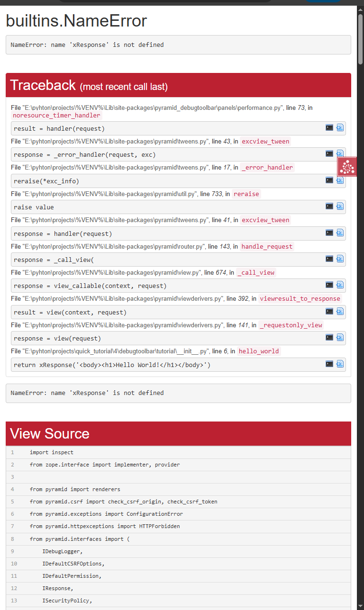

# ANALISIS CODE

- DebugToolbar merupakan alat bantu interaktif add-on dari python yang dibutuhkan untuk memudahkan melakukan debug code jika terjadinya error, saat sudah menginstall kita dapat memakainya pada ui di sisi kanan bawah halaman web saat aplikasi web sedang berjalan di mode development.

## Extra Credit

1. Sebenarnya ini juga menyambung pada analisis kemarin dimana file ini bisa dipisah untuk produksi dan development, hal tersebut dapat digunakan untuk memisahkan tool produksi dan development sehingga dapat memisahkan tool apa saja yang diperlukan saat tahap produksi

2. berikut fitur tooldebug yang sudah diinstall sebelumnya:
